**TDD trong Laravel**

**Test Driven Development (TDD)** là một phương pháp phát triển phần
mềm, thay vì viết code sau đó viết test case để kiểm thử **(Test Last
Development)** . Ta làm theo hướng ngược lại, viết các test case để kiểm
thử trước , sau đó viết code để thỏa mãn các test case đó. **(Test First
Development)**

I.  **Cách thực hiện TDD**

```{=html}
<!-- -->
```
1.  **Viết một test case ( màu đỏ )**

*Viết code cần và (vừa)đủ để làm sao pass được test case vừa viết*

*Nghĩ về một tính năng và viết test case cho nó, vì tính năng này chưa
được implement, test case này chắc chắn sẽ fail*

2.  **Sửa code cho test pass ( màu xanh )**

*Viết code cần và (vừa)đủ để làm sao pass được test case vừa viết*

3.  **Loại bỏ code dư thừa, cải thiện code (Refactor)**

*Vì ở bước 2 ta chỉ viết cho (vừa)đủ để pass test case , sau khi
implement đầy đủ các tính năng thì giờ đã đến lúc để nghĩ đến việc
refactoring code làm sao cho dễ đọc, dễ hiểu hoặc làm sao cho nó có hiệu
năng tốt hơn*

{width="6.730435258092738in"
height="3.59584208223972in"}

***Thực hiện quy trình trên cho đến khi implement và pass được tất cả
các requirements được đặt ra ⇒ Code được 100% test coverage***

**Xây dựng một website Todolist Laravel đơn giản áp dụng TDD**

**Ở đây ta sẽ xây dựng một app Todolist đơn giản áp dụng quy trình TDD**

Đối với một project laravel mới được tạo, laravel đã được mặc định kèm
sẵn plugin để viết unit test, plugin này có tên là ***phpunit***

{width="6.736758530183727in"
height="3.6956528871391074in"}

**Cách sử dụng phpunit để chạy unit test ( trên nền CLI )**

Ta sử dụng lệnh: ***vendor/bin/phpunit***

Ta được kết quả như sau:

{width="6.721738845144357in"
height="2.015498687664042in"}

Sở dĩ có 2 tests ở đây là vì trong template của laravel có sẵn 2 file
test làm ví dụ, 2 file này nằm lần lượt ở

***tests\\Unit\\ExampleTest.php***

***tests\\Feature\\ExampleTest.php***

**Xóa cả hai file này bởi vì chúng ta không cần đến chúng**

Để chạy một test unit cụ thể , ta sử dụng thêm thuộc tính
***---fliter*** kèm với ***class name*** hoặc ***method name***, ví dụ:

***vendor/bin/phpunit \--filter ExampleTest***

***vendor/bin/phpunit \--filter test_example***

Ở đây ta sẽ dùng laravel viết một ứng dụng Todolist đơn giản (thêm, xóa
đã làm, set đã làm) nhưng theo hướng TDD

Tạo một file Unit Test mới bằng lệnh : **php artisan make:test
TodoTest**

Giờ ta có file ***tests\\Feature\\TodoTest.php***

Giả sử requirement yêu cầu homepage của app todo của chúng ta nằm ở
route ***todoapp*** , hay ***http://127.0.0.1:8000/todoapp***

Thay vì lao đầu vào viết code tạo route luôn thì thay vào đó ta sẽ viết
test case trước

**Có 2 cách để viết function test**

1.  **Thêm tiền tố test\_ vào trước tên hàm**

Ví dụ hàm test của mình đặt tên là
***app_homepage_accessible_in_todoapp_route*** thì phải thêm tiền tố
***test\_*** vào phía trước

Ta có***: test_app_homepage_accessible_in_todoapp_route***

{width="6.765548993875766in"
height="3.3613123359580053in"}

2.  **Dùng test annotation**

Với test annotation thì hàm test của mình sẽ không cần tiền tố
***test\_*** nữa nhưng ta phải để test annotation: ***/\*\* \@test
\*/*** lên trên đầu hàm

{width="6.75676290463692in"
height="3.653834208223972in"}

**Bắt buộc phải dùng 1 trong 2 cách trên , nếu không phpunit sẽ báo *No
tests found ***

Ta chạy test unit vừa mới viết trên

{width="6.765459317585302in"
height="3.2906977252843395in"}

Test case ở trên kiểm tra xem route ***todoapp*** có truy cập được không
, nếu truy cập được thì có http status trả về là 200

Ở đây phpunit báo lỗi test failed , ***[cơ mà đây chính xác những gì ta
hướng đến khi viết theo phương pháp TDD]{.underline}*** (bước 1 của TDD
như đã giới thiệu ở trên)

Giờ chúng ta chuyển sang bước 2, viết code để thõa mãn test case ta vừa
viết

**Tạo file resources\\views\\todoapp.blade.php**

**Thêm route vào routes\\web.php**

{width="4.034722222222222in"
height="0.8263888888888888in"}

Chạy lại test case, ta thấy test case đã passed, hoàn thành được mục
tiêu test first (**Test Driven Development - TDD**)

{width="6.675306211723535in"
height="1.5260640857392826in"}

**TDD có một mô hình test 3 pha (3-phase pattern) gồm:**

**Arrange** ⇒ là function khởi tạo môi trường cần thiết cho quá trình
test

**Act** ⇒ là khi Arrange đã hoàn thành xong công việc , Act chứa những
đoạn code để thực hiện bài test

**Assertion** ⇒ là khi Act đã được chạy, Assertion kiểm tra xem Act có
hoạt động đúng như mong đợi hay không

**Áp dụng mô hình này vào ứng dụng , ta có quy trình sau**

**Arrange** ⇒ seed dữ liệu giả vào database

***[Ta add model của Todo vào trong test class , dù model này chưa được
khởi tạo]{.underline}***

Ta seed dữ liệu giả vào bằng Factory

{width="6.826388888888889in"
height="4.852083333333334in"}

***Ta chạy lại test case***

{width="6.999698162729659in"
height="2.085041557305337in"}

***Test case failed vì model Todo không tồn tại, ta tiến hành tạo model
Todo bằng lệnh***

***php artisan make:model Todo***

***Ta chạy lại test case***

{width="6.84375in"
height="0.6784722222222223in"}

***[Test case failed vì TodoFactory không tồn tại]{.underline}***

Lại tiếp tục debug bằng cách tạo class Factory mới bằng lệnh

***php artisan make:factory TodoFactory***

{width="7.105685695538058in"
height="0.6185411198600175in"}

***[Test case failed vì database không tồn tại]{.underline}***

Tạo database bằng phpmyadmin, navicat, hoặc bất cứ trình quản lý
database nào bạn có

{width="4.738888888888889in"
height="2.009027777777778in"}

{width="7.090102799650044in"
height="0.4in"}

***[Test case failed vì database không có table cần
thiết]{.underline}***

**Tạo table bằng laravel migration**

***php artisan make:migration create_todos_table***

Trong ***database\\migrations\\{date-time}\_create_todos_table.php***
thêm các trường cần thiết cho table

{width="6.782638888888889in"
height="2.4090277777777778in"}

**Ta tiến hành Migrate database**

***php artisan migrate***

***Lại chạy lại testcase***

{width="6.96213145231846in"
height="0.41762904636920384in"}

Test case failed vì factory không có structure cụ thể để seed dummy data
vào database

Vào file : ***database\\factories\\TodoFactory.php***

**Them structure definition cho TodoFactory**

{width="5.747916666666667in"
height="3.782638888888889in"}

***Test case passed***

{width="6.286836176727909in"
height="1.8768536745406823in"}{width="5.573611111111111in"
height="1.582638888888889in"}

***Database đã được seed dummy data , hoàn thành Arrange parse***

2\. **Act** ⇒ redirect về route todoapp

{width="6.76551946631671in"
height="3.467929790026247in"}

3.  **Assertion** ⇒ Kiểm tra xem các todo trong database đã được pass
    trong view hay chưa

{width="6.800275590551181in"
height="3.24338801399825in"}

***[Test case thông báo failed , không tìm thấy object được pass trong
view]{.underline}***

{width="6.774063867016623in"
height="2.2597265966754154in"}

***[Tiến hành debug web.php , pass object todos sang
views]{.underline}***

{width="5.24375in"
height="1.1652777777777779in"}

***[Chạy lại test case , ta thấy test case đã passed]{.underline}***

{width="6.83463145231846in"
height="1.8148829833770779in"}

**Tiến tục áp dụng TDD cho tất cả các functions và requirements còn
lại**

**Test-case: Kiểm tra xem có add dữ liệu được vào database không**

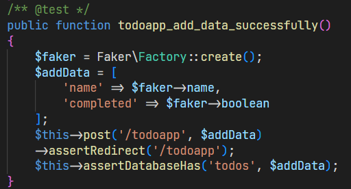{width="5.3340780839895015in"
height="2.87540135608049in"}

***[Lỗi vì route chưa được tạo]{.underline}***

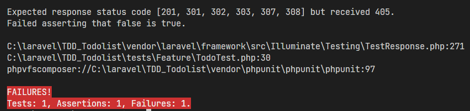{width="6.091646981627297in"
height="1.4376541994750656in"}

***Tạo route để fix lỗi***

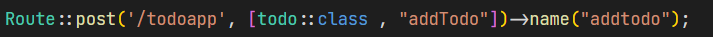{width="6.5in" height="0.3375in"}

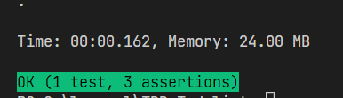{width="4.021394356955381in"
height="1.156411854768154in"}

**Test-case: Kiểm tra xem có thay đổi trạng thái completed của todo
trong database được không**

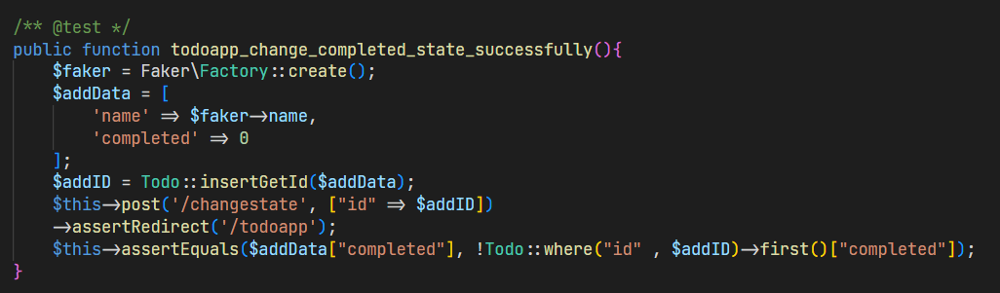{width="6.5in"
height="1.9069444444444446in"}

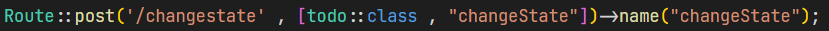{width="6.5in"
height="0.24305555555555555in"}

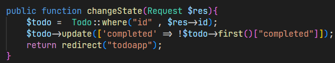{width="6.5in"
height="1.2319444444444445in"}

**Test-case: Kiểm tra xem có xóa được tất cả những todos đã hoàn thành
hay không**

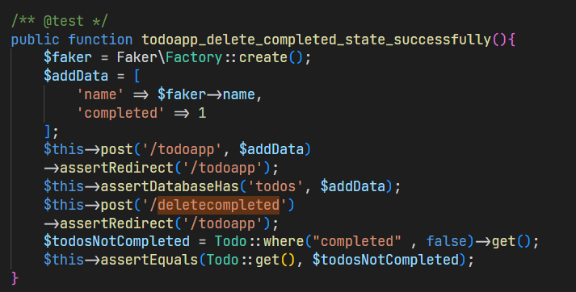{width="6.5in" height="3.3in"}

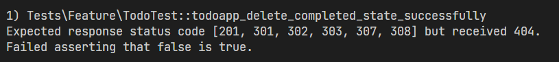{width="6.5in"
height="0.7256944444444444in"}

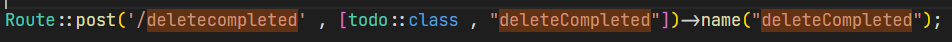{width="6.5in"
height="0.28680555555555554in"}

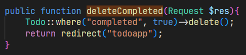{width="5.063206474190726in"
height="1.1459930008748906in"}

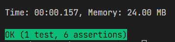{width="3.7296872265966754in"
height="0.9063768591426071in"}

**Merge route, controller đã build theo TDD vào UI**

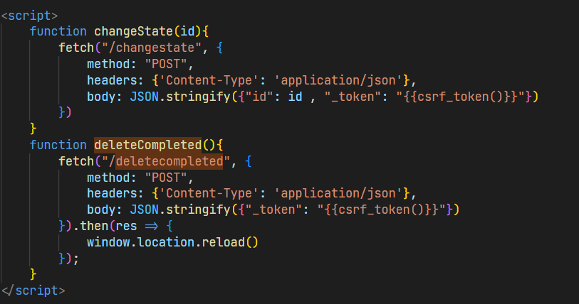{width="6.5in"
height="3.421527777777778in"}

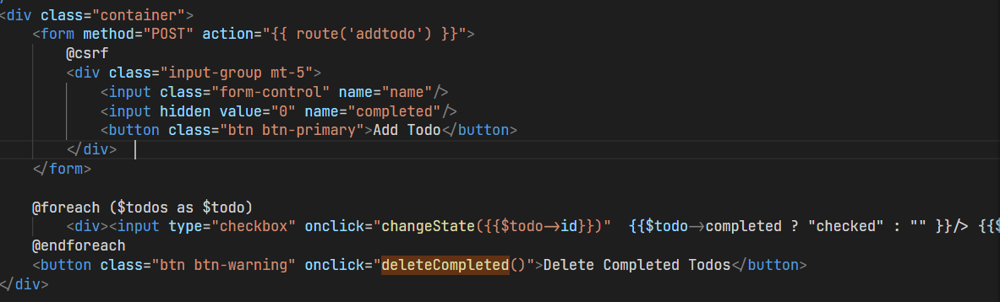{width="6.5in"
height="1.9666666666666666in"}

**Kết quả: App TodoList được xây dựng theo phương pháp TDD**

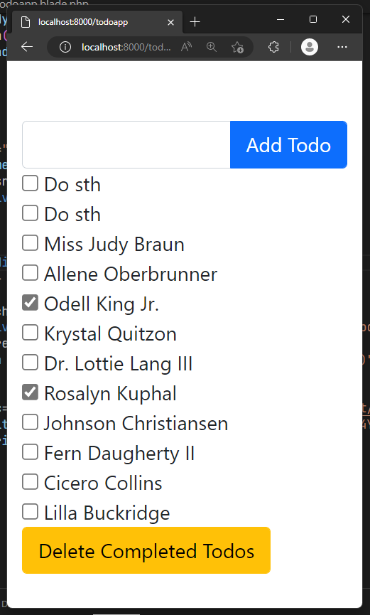{width="2.748999343832021in"
height="4.564058398950131in"}

**Reactor Code**

Ta tìm các cách để rút gọn + cải thiện code ***, ví dụ như*** nhét web
route vào controller riêng, \...

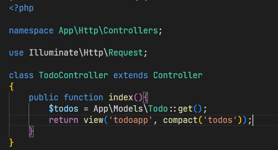{width="5.875820209973753in"
height="3.17752624671916in"}

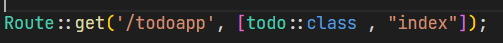{width="5.240314960629921in"
height="0.44797900262467194in"}
