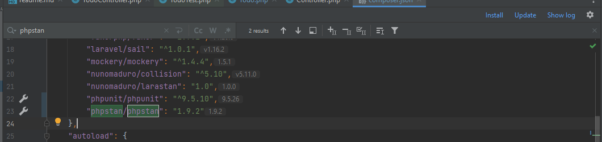
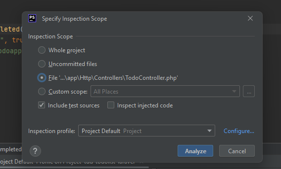
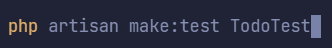

Viết test TDD trong Laravel sử dụng PHPStan + PHPUnit

PHPStan là một công cụ phân tích giúp kiểm tra lỗi mà không cần viết
test , mang lại tính năng khiến cho PHP trở thành một complied language
như Java hay C# hoặc tương tự như TypeScript, bắt lỗi trước runtime.

PHPStan cho 10 mức độ (level) để check , analysis code, bao gồm:

Level 1: Kiểm tra classes , functions, các method được gọi có tồn tại
hay không, số lượng tham số (parameters) chuyền vào có đúng không, kiểm
tra biến (variable) có được defind hay chưa

Level 2: Các biến, methods được gọi có thể chưa được defind lúc runtime

Level 3: Check tất cả các methods, kể cả những methods không được gọi

Level 4: Bắt buộc phải định nghĩa kiểu dữ liệu trả về cho hàm

Level 5: Kiểm tra dead code ( code không được sử dụng đến )

Level 6: Kiểm tra kiểu dữ liệu của parameters được truyền vào

Level 7: Báo cáo lỗi đánh máy

Level 8: Báo lỗi nếu gọi methods có khả năng không tồn tại.

Level 9: Không cho phép gọi hàm và methods trên undefinded object

Level 10: Giới hạn mixed type trong php, chỉ có thể gán mixed type vào
một variable mixed type khác.

Cài đặt phpstan, đối với laravel thì ta sẽ sử dụng thư viện larastan
thay cho phpstan thông thường.

Đối với laravel 9.0+

composer require nunomaduro/larastan:\^2.0 --dev

Đối với laravel cũ hơn

composer require nunomaduro/larastan:\^1.0 --dev

Ta tạo file phpstan.neon ở thư mục root

Dựa theo mức độ level ở trên ta chỉ cần dùng đến level 5, phần paths ta
thêm những thư mục chứa code cần check.

Ta includes config của larastan , để tránh báo lỗi khi dùng eloquent của
laravel

{width="6.344635826771653in"
height="2.4065857392825896in"}

Tạo một file test mới

{width="3.4588156167979003in"
height="0.5000699912510936in"}

Chạy test của phpstan

{width="6.5in" height="1.60625in"}

Ta tiến hành viết test theo hướng TDD như thông thường

tests\\Feature\\TodoTest.php

{width="6.5in"
height="4.661111111111111in"}

{width="6.5in"
height="3.8666666666666667in"}

PHPStan báo lỗi không có model, ta tiến hành tạo model mới

{width="6.5in"
height="0.8534722222222222in"}

Chạy lại phpstan

{width="6.5in"
height="1.4840277777777777in"}

Giờ làm tương tự để build môi trường như trong TDD, để cho tiện thì mình
có thể dùng [tuantyler/tdd-todolist-laravel
(github.com)](https://github.com/tuantyler/tdd-todolist-laravel)

Làm project để bắt đầu, config giống như trên, develop tương tự như TDD
thông thường

Tùy vào độ strict cũng như chuẩn convention code cần thiết cho project
thì ta có thể nâng level của phpstan / larastan lên

Ví dụ như level 9

{width="6.5in"
height="3.592361111111111in"}

Và ta resolve theo lỗi được báo , ví dụ như defind kiểu trả về cho
controller và function

{width="5.532022090988627in"
height="1.989861111111111in"}
